# Ejercicios Git y Github I

## Repositorio DEAW
Crear un repositorio en vuestro GitHub llamado DEAW.

Clonar vuestro repositorio en local.

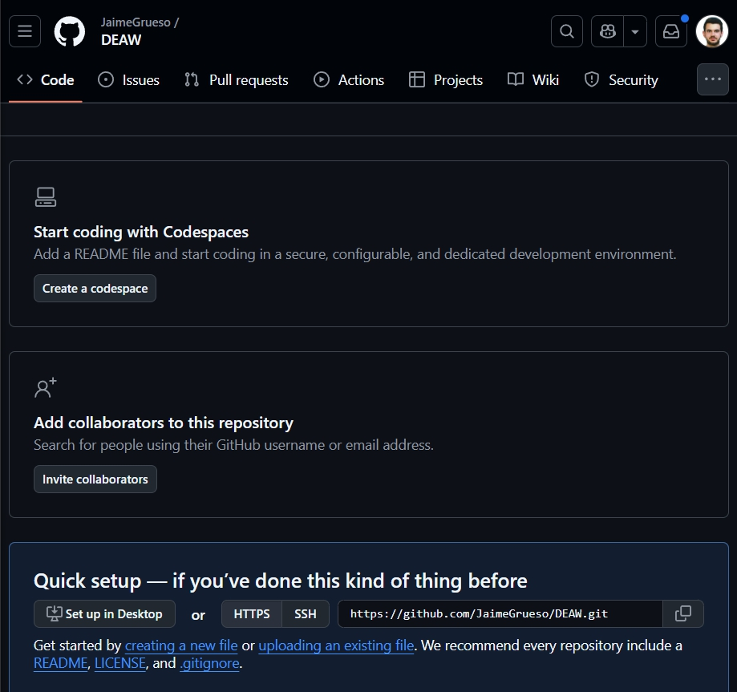

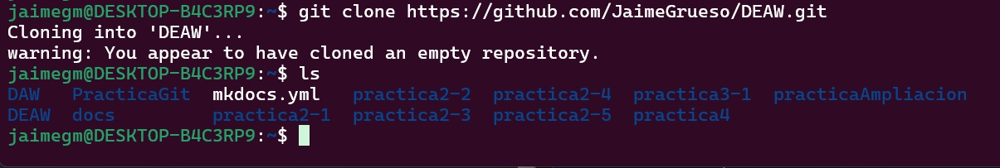

## Readme
Crear en vuestro repositorio local un documento README.md

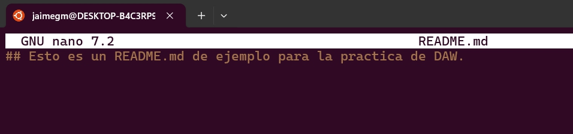

## Commit
Realizar un commit inicial con el comentario Comenzamos con los ejercicios de Git

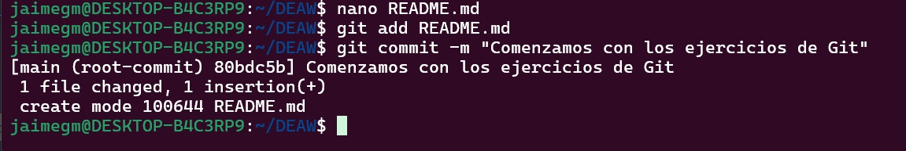

## Push
Subir los cambios al repositorio remoto

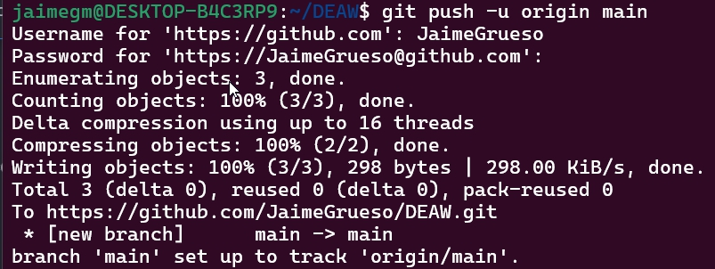
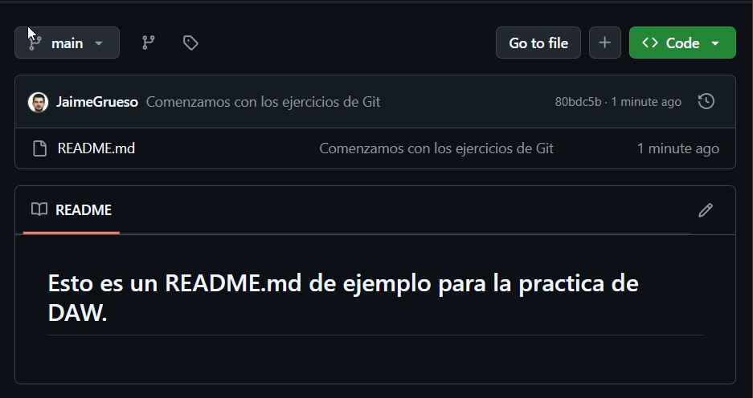

## Ignorar archivos
Crear en el repositorio local un fichero llamado privado.txt.

Crear en el repositorio local una carpeta llamada privada.

Realizar los cambios oportunos para que tanto el archivo como la carpeta sean ignorados por git.

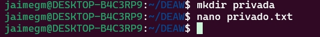

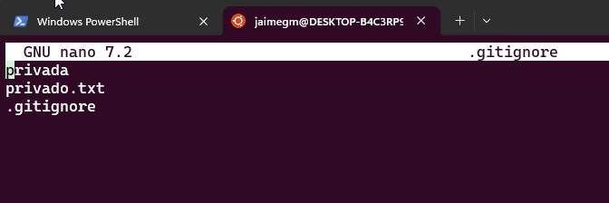

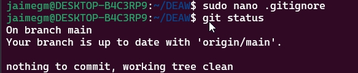

## Añadir fichero 1.txt
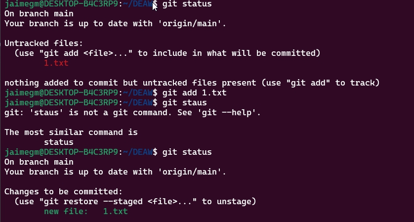

## Crear un tag y subirlo al repositorio remoto

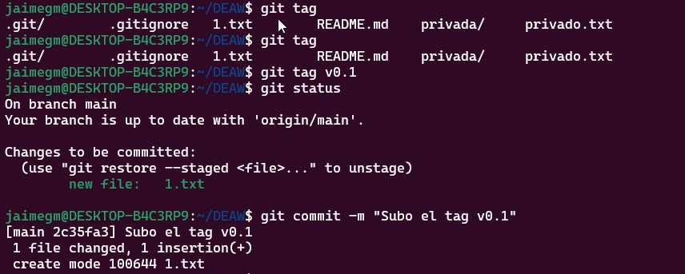

## Cuenta de GitHub

Poner una foto de perfil y doble factor de autenticación en vuestra cuenta de GitHub.

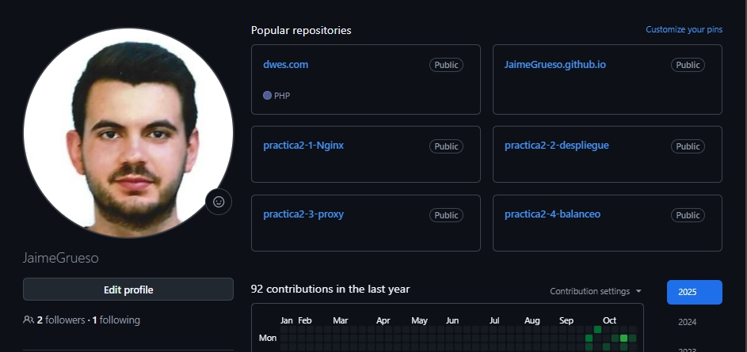

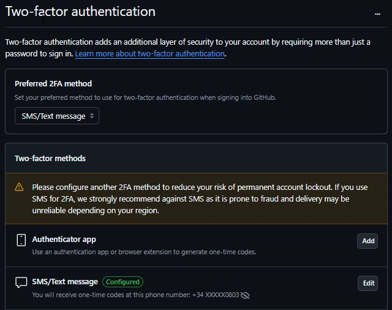

## Uso Social de Github
Preguntar los nombres de usuario de GitHub de 2 de tus compañeros de clase, búscalos, y sigueles.

Seguir los repositorios DEAW del resto de tus compañeros.

Añadir una estrella a los repositorios DEAW del resto de tus compañeros.

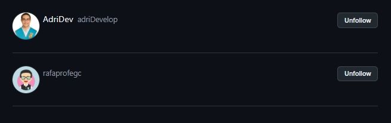

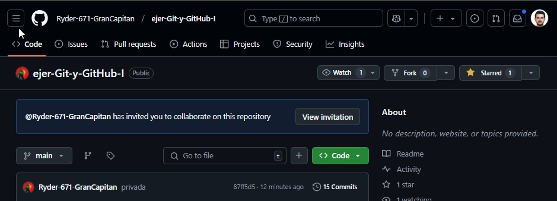

## Crear una tabla
Crear una tabla en el fichero README.md con la información básica de los compañeros de clase.

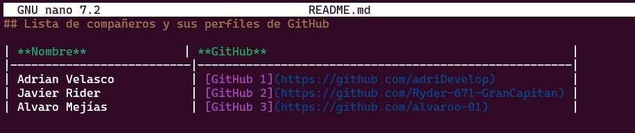

## Colaboradores
Añadir a un compañero de clase como colaborador del repositorio DEAW.

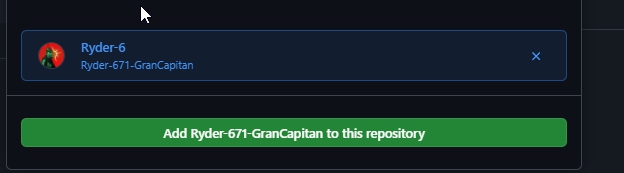

## Crear una rama v0.2 y añaadir un fichero 2.txt
Crear una rama v0.2 y cambiar a esa rama.

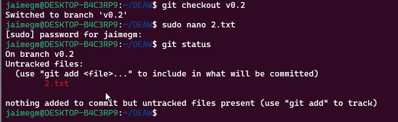

## Crear rama remota v0.2

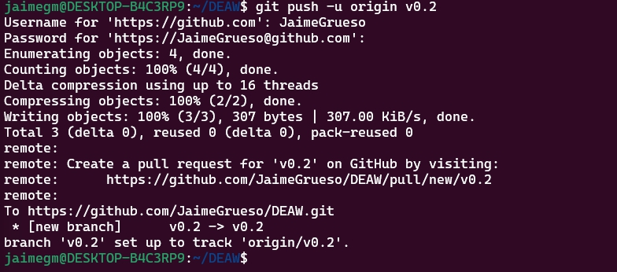

## Merge Directo
Posicionarse en la rama master.

Hacer un merge de la rama v0.2 en la rama master.

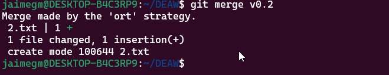

## Merge con conflicto
En la rama master poner Hola en el fichero 1.txt y hacer commit.

Posicionarse en la rama v0.2 y poner Adios en el fichero "1.txt" y hacer commit.

Posicionarse de nuevo en la rama master y hacer un merge con la rama v0.2

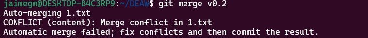

## Listado de ramas

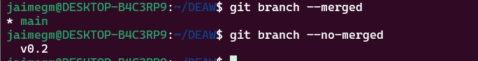

## Arreglar el conflicto

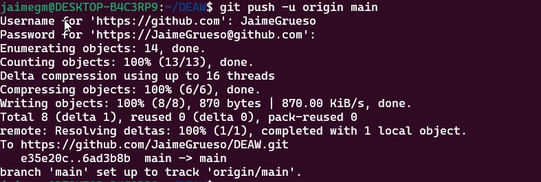

## Listado de ramas
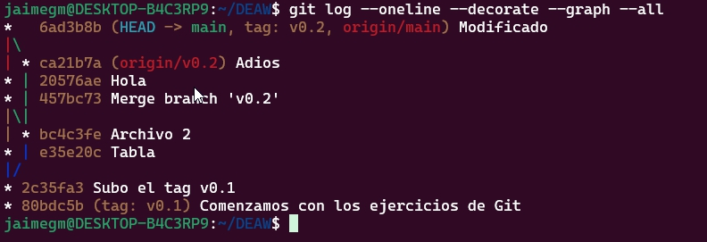

