# Ejercicios Git y Github II

## Ejercicios de Creación y Actualización de Repositorios

### Ejercicio 1

Configurar Git definiendo el nombre del usuario, el correo electrónico y activar el coloreado de la salida.

Mostrar la configuración final.

### Ejercicio 2
Crear un repositorio nuevo con el nombre libro y mostrar su contenido.

### Ejercicio 3

Comprobar el estado del repositorio.

Crear un fichero indice.txt con el siguiente contenido:

Capítulo 1: Introducción a Git
Capítulo 2: Flujo de trabajo básico
Capítulo 3: Repositorios remotos
Comprobar de nuevo el estado del repositorio.

Añadir el fichero a la zona de intercambio temporal.

Volver a comprobar una vez más el estado del repositorio.

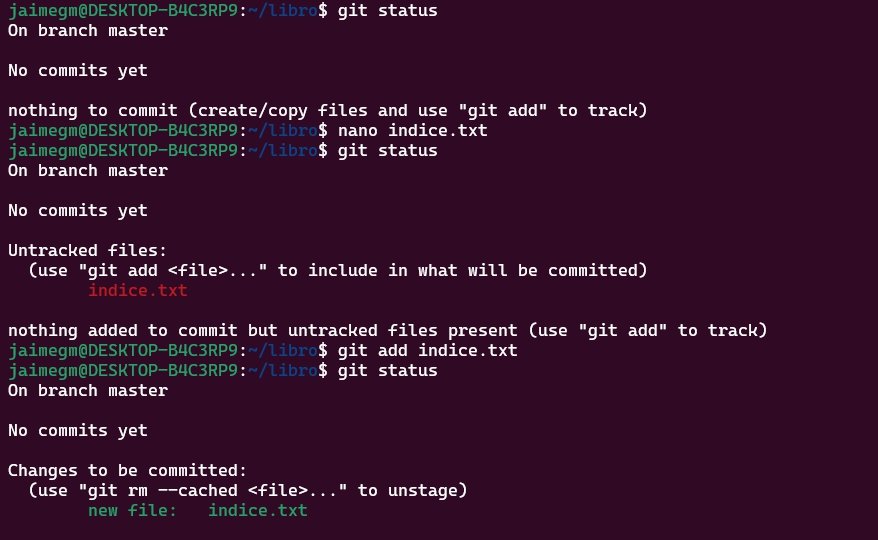

### Ejercicio 4
Realizar un commit de los últimos cambios con el mensaje “Añadido índice del libro.” y ver el estado del repositorio.

### Ejercicio 5
Cambiar el fichero indice.txt para que contenga lo siguiente:

Capítulo 1: Introducción a Git
Capítulo 2: Flujo de trabajo básico
Capítulo 3: Gestión de ramas
Capítulo 4: Repositorios remotos

Mostrar los cambios con respecto a la última versión guardada en el repositorio.

Hacer un commit de los cambios con el mensaje “Añadido capítulo 3 sobre gestión de ramas”.

### Ejercicio 6
Mostrar los cambios de la última versión del repositorio con respecto a la anterior.

Cambiar el mensaje del último commit por “Añadido capítulo 3 sobre gestión de ramas al índice.”

Volver a mostrar los últimos cambios del repositorio.

## Ejercicios de manejo del historial de cambios

### Ejercicio 1
Mostrar el historial de cambios del repositorio.

Crear la carpeta capitulos y crear dentro de ella el fichero capitulo1.txt con el siguiente texto.

Git es un sistema de control de versiones ideado por Linus Torvalds.

Añadir los cambios a la zona de intercambio temporal.

Hacer un commit de los cambios con el mensaje “Añadido capítulo 1.” Volver a mostrar el historial de cambios del repositorio.

### Ejercicio 2
Crear el fichero capitulo2.txt en la carpeta capitulos con el siguiente texto.

El flujo de trabajo básico con Git consiste en: 1- Hacer cambios en el repositorio. 2- Añadir los cambios a la zona de intercambio temporal. 3- Hacer un commit de los cambios.

Añadir los cambios a la zona de intercambio temporal.

Hacer un commit de los cambios con el mensaje “Añadido capítulo 2.”

Mostrar las diferencias entre la última versión y dos versiones anteriores.

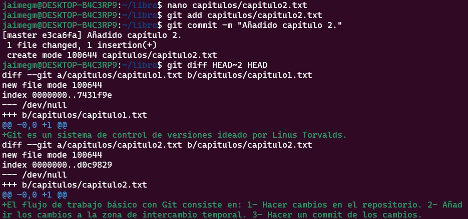

### Ejercicio 3
Crear el fichero capitulo3.txt en la carpeta capitulos con el siguiente texto.

Git permite la creación de ramas lo que permite tener distintas versiones del mismo proyecto y trabajar de manera simultanea en ellas.

Añadir los cambios a la zona de intercambio temporal.

Hacer un commit de los cambios con el mensaje “Añadido capítulo 3.”

Mostrar las diferencias entre la primera y la última versión del repositorio.

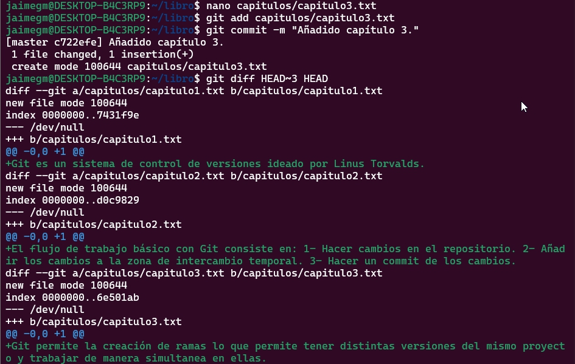

### Ejercicio 4
Añadir al final del fichero indice.txt la siguiente línea:

Capítulo 5: Conceptos avanzados

Añadir los cambios a la zona de intercambio temporal.

Hacer un commit de los cambios con el mensaje “Añadido capítulo 5 al índice.”.

Mostrar quién ha hecho cambios sobre el fichero indice.txt.

## Ejercicios de deshacer cambios

### Ejercicio 1

Eliminar la última línea del fichero indice.txt y guardarlo.

Comprobar el estado del repositorio.

Deshacer los cambios realizados en el fichero indice.txt para volver a la versión anterior del fichero.

Volver a comprobar el estado del repositorio.

### Ejercicio 2
Eliminar la última línea del fichero indice.txt y guardarlo.

Añadir los cambios a la zona de intercambio temporal.

Comprobar de nuevo el estado del repositorio.

Quitar los cambios de la zona de intercambio temporal, pero mantenerlos en el directorio de trabajo.

Comprobar de nuevo el estado del repositorio.

Deshacer los cambios realizados en el fichero indice.txt para volver a la versión anterior del fichero.

Volver a comprobar el estado del repositorio.

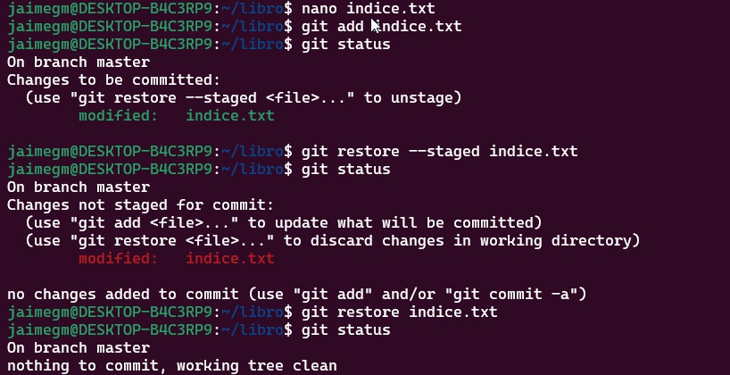

### Ejercicio 3
Eliminar la última línea del fichero indice.txt y guardarlo.

Eliminar el fichero capitulos/capitulo3.txt.

Añadir un fichero nuevo capitulos/capitulo4.txt vacío.

Añadir los cambios a la zona de intercambio temporal.

Comprobar de nuevo el estado del repositorio.

Quitar los cambios de la zona de intercambio temporal, pero mantenerlos en el directorio de trabajo.

Comprobar de nuevo el estado del repositorio.

Deshacer los cambios realizados para volver a la versión del repositorio.

Volver a comprobar el estado del repositorio.

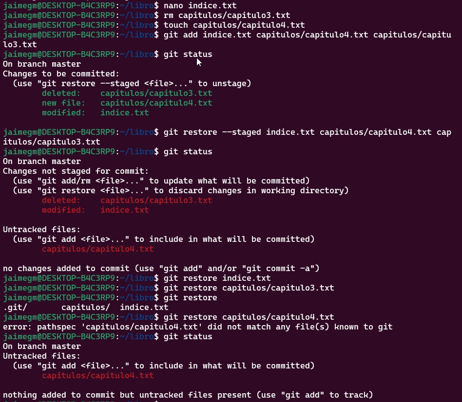

### Ejercicio 4
Eliminar la última línea del fichero indice.txt y guardarlo.

Eliminar el fichero capitulos/capitulo3.txt.

Añadir los cambios a la zona de intercambio temporal y hacer un commit con el mensaje “Borrado accidental.”

Comprobar el historial del repositorio.

Deshacer el último commit pero mantener los cambios anteriores en el directorio de trabajo y la zona de intercambio temporal.

Comprobar el historial y el estado del repositorio.

Volver a hacer el commit con el mismo mensaje de antes.

Deshacer el último commit y los cambios anteriores del directorio de trabajo volviendo a la versión anterior del repositorio.

Comprobar de nuevo el historial y el estado del repositorio.

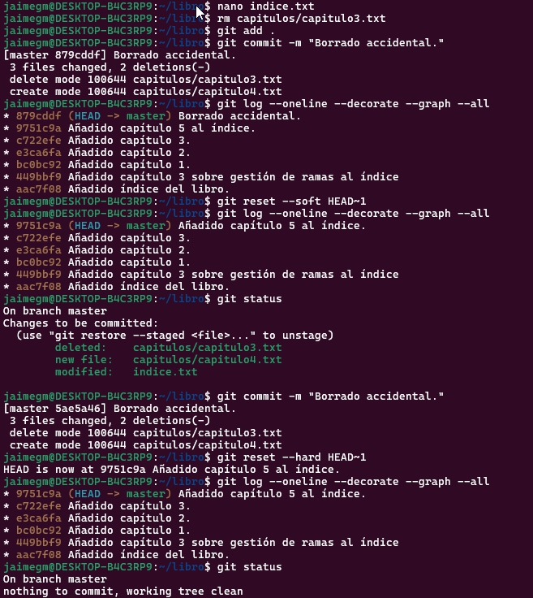

## Ejercicios de gestión de ramas

### Ejercicio 1
Crear una nueva rama bibliografia y mostrar las ramas del repositorio.

### Ejercicio 2
Crear el fichero capitulos/capitulo4.txt y añadir el texto siguiente

En este capítulo veremos cómo usar GitHub para alojar repositorios en remoto.

Añadir los cambios a la zona de intercambio temporal.

Hacer un commit con el mensaje “Añadido capítulo 4.”

Mostrar la historia del repositorio incluyendo todas las ramas.

### Ejercicio 3
Cambiar a la rama bibliografia.

Crear el fichero bibliografia.txt y añadir la siguiente referencia

Chacon, S. and Straub, B. Pro Git. Apress.

Añadir los cambios a la zona de intercambio temporal.

Hacer un commit con el mensaje “Añadida primera referencia bibliográfica.”

Mostrar la historia del repositorio incluyendo todas las ramas.

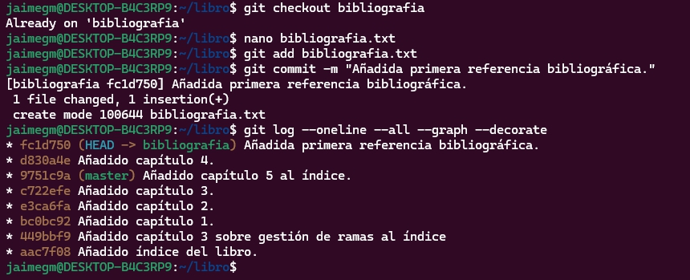

### Ejercicio 4
Fusionar la rama bibliografia con la rama master.

Mostrar la historia del repositorio incluyendo todas las ramas.

Eliminar la rama bibliografia.

Mostrar de nuevo la historia del repositorio incluyendo todas las ramas.

### Ejercicio 5
Crear la rama bibliografia.

Cambiar a la rama bibliografia.

Cambiar el fichero bibliografia.txt para que contenga las siguientes referencias:

Scott Chacon and Ben Straub. Pro Git. Apress.
Ryan Hodson. Ry’s Git Tutorial. Smashwords (2014)

Añadir los cambios a la zona de intercambio temporal y hacer un commit con el mensaje “Añadida nueva referencia bibliográfica.”

Cambiar a la rama master.

Cambiar el fichero bibliografia.txt para que contenga las siguientes referencias:

Chacon, S. and Straub, B. Pro Git. Apress.
Loeliger, J. and McCullough, M. Version control with Git. O’Reilly.

Añadir los cambios a la zona de intercambio temporal y hacer un commit con el mensaje “Añadida nueva referencia bibliográfica.”

Fusionar la rama bibliografia con la rama master.

Resolver el conflicto dejando el fichero bibliografia.txt con las referencias:

Chacon, S. and Straub, B. Pro Git. Apress.
Loeliger, J. and McCullough, M. Version control with Git. O’Reilly.
Hodson, R. Ry’s Git Tutorial. Smashwords (2014)

Añadir los cambios a la zona de intercambio temporal y hacer un commit con el mensaje “Resuelto conflicto de bibliografía.”

Mostrar la historia del repositorio incluyendo todas las ramas.

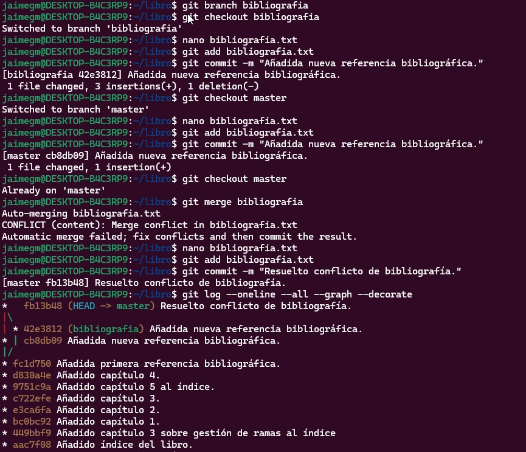

## Ejercicios de repositorios remotos

### Ejercicio 1
Crear un nuevo repositorio público en GitHub con el nombre libro-git.

Añadirlo al repositorio local del libro.

Mostrar todos los repositorios remotos configurados.

### Ejercicio 2
Añadir los cambios del repositorio local al repositorio remoto de GitHub.

Acceder a GitHub y comprobar que se han subido los cambios mostrando el historial de versiones.

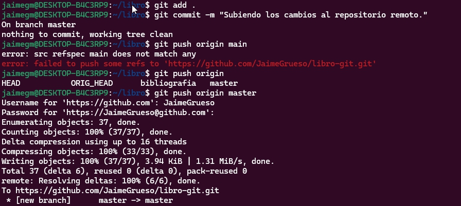

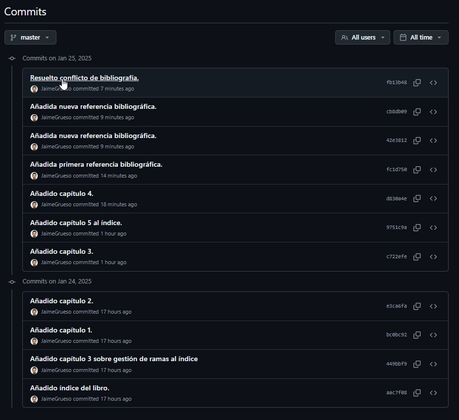

### Ejercicio 3
Colaborar en el repositorio remoto libro-git de otro usuario.

Clonar su repositorio libro-git.

Añadir el fichero autores.txt que contenga el nombre del usuario y su correo electrónico.

Añadir los cambios a la zona de intercambio temporal.

Hacer un commit con el mensaje “Añadido autor.”

Subir los cambios al repositorio remoto.

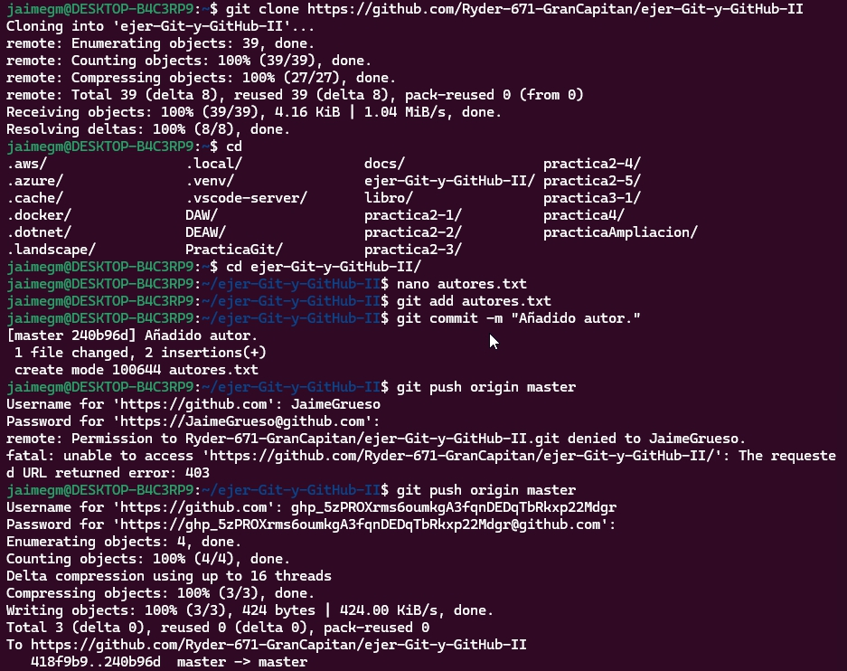

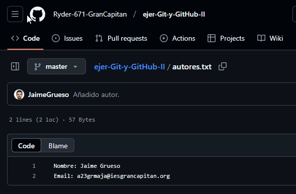

### Ejercicio 4
Hacer una bifurcación del repositorio remoto asalber/libro-git en GitHub.

Clonar el repositorio creado en la cuenta de GitHub del usuario.

Crear una nueva rama autoria y activarla.

Añadir el nombre del usuario y su correo al fichero autores.txt.

Añadir los cambios a la zona de intercambio temporal.

Hacer un commit con el mensaje “Añadido nuevo autor.”

Subir los cambios de la rama autoria al repositorio remoto en GitHub.

Hacer un Pull Request de los cambios en la rama autoria.

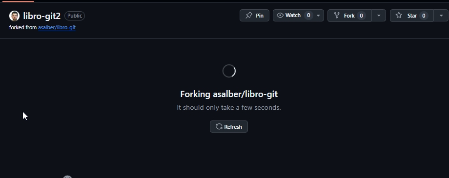

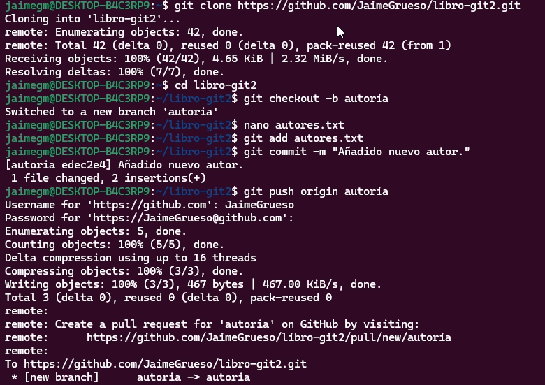

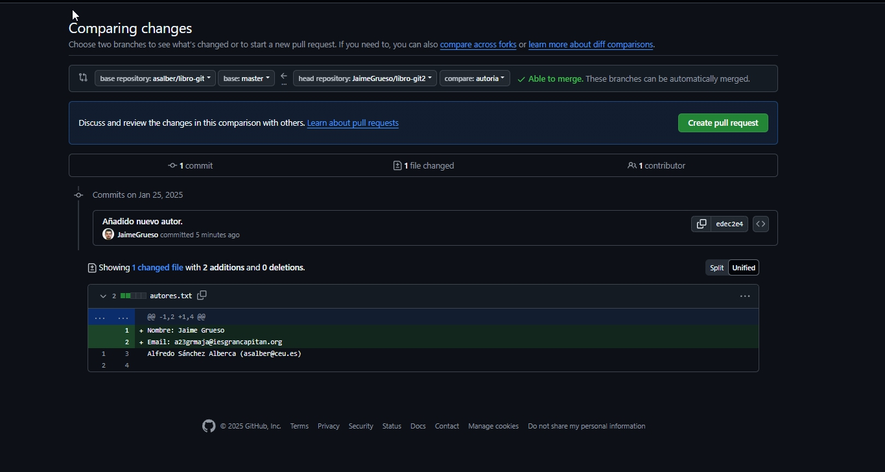

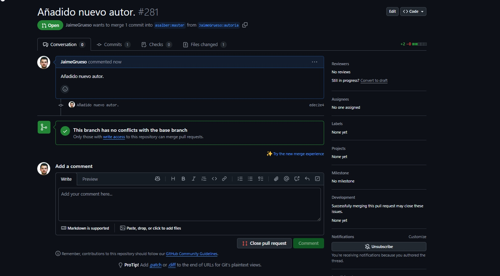